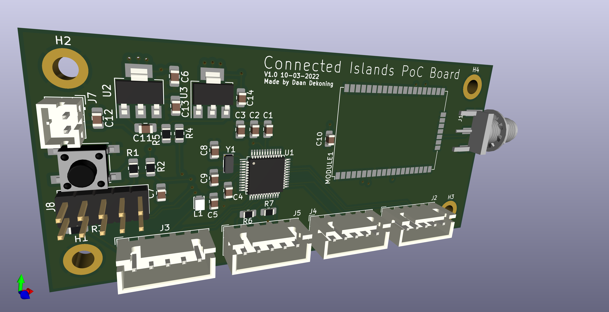

### TODO Schema

- [x] Power Supply Connections
- [x] Voltageregulators 3.3V en 5V
- [x] External Reset
- [x] Clock & Oscillator
- [x] Programming & debug connection
- [x] 4x UART
- [x] 1x SPI
- [x] 1x I²C
- [x] I²C pull-up resistors (https://rheingoldheavy.com/i2c-pull-resistors/)
- [x] Connection battery voltage to ADC
- [x] RN2483 LoRaWAN module

### Power Delivery

We are using a Li-Po 2 Cell betterij and a LD1117 as 3.3V and 5V regulator

Li-Po 2 Cell: [Store](https://www.conrad.be/p/conrad-energy-lipo-accupack-74-v-2400-mah-aantal-cellen-2-20-c-softcase-xt60-1344133), [Datasheet](https://asset.conrad.com/media10/add/160267/c1/-/en/001344133SD01/veiligheidsvoorschriften-1344133-conrad-energy-lipo-accupack-74-v-2400-mah-aantal-cellen-2-20-c-softcase-xt60.pdf)

LD1117: [Store](https://www.conrad.be/p/stmicroelectronics-ld1117av33-spanningsregelaar-lineair-to-220ab-positief-vast-1-a-1184973), [Datasheet](https://asset.conrad.com/media10/add/160267/c1/-/en/001184973DS01/datablad-1184973-stmicroelectronics-ld1117av33-spanningsregelaar-lineair-to-220ab-positief-vast-1-a.pdf)

The LD1117 IC's are connected according to "Figure 3. Application circuit (for fixed output voltages)". 1x 5V en 1x 3.3V.

The dropout voltage of these regulators is 1.05V if we're counting for a 500mAh load. to get an output voltage of 5V, the regulator needs an input voltage of 5V + 1.05V = 6.05V. Thus our battery voltage has to stay above that value.

ADC voltage divider for battery:

R1 = 10 kOhm; R2 = 4.7 kOhm

### AT SAMD 21 Schematic Checklist

Datasheet p1108-p1118

#### Power Supply Connections

- [x] Check L1 10µH footprint. (https://be.farnell.com/tdk/vls201612hbx-100m-1/inductor-10uh-20-0-79a-shld/dp/2455369 ) (https://www.farnell.com/datasheets/2608157.pdf )

The MCU has two DVVIO pins (pin17 en pin36), these are internally connected to eachother so ony pin17 is in use.

#### External Analog Reference Connections

Not necessary because we are not useing any external analog references.

#### External Reset Circuit

EFT = electrical fast transients -> spark when pressing a button

We don't need this EFT Immunity Enhancement so we're using "Figure 45-4. External Reset Circuit Schematic".

#### Clocks and Crystal Oscillators

[Understanding the SAM D21 clocks](https://blog.thea.codes/understanding-the-sam-d21-clocks/)

We keep the option to use an external 32,768kHz clock free, when not in use it doesn't have to be soldered on the PCB.

- [Capacitor](https://be.farnell.com/multicomp/mc0805n180j500ct/cap-18pf-50v-5-c0g-np0-0805/dp/1759194): MC0805N180J500CT, 18 pF, 0805
- [Crystal](https://be.farnell.com/fox-electronics/fx135a-327/crystal-32-768khz-12-5pf-smd/dp/2064037): FX135A-327, 32.768 kHz, SMD

Connected according to: "Figure 45-9. External Real Time Oscillator with Load Capacitor".

`XIN32` and `XOUT32` are on the only avalable connections for SERCOM1 (PA00 en PA01) so SERCOM1 will not be used.

#### Programming and Debug Ports

Pull-up reistor on SWCLK!

We are using "Figure 45-12. 10-pin JTAGICE3 Compatible Serial Wire Debug Interface".

#### USB Interface

We are not using the USB interface.

### SERCOM Aansluiten

The used SERCOM pins of the SAM D21 got a `SERCOMx_PADn_y` label for easy reference on the scheme and PCB. The Atmel START configuration was used as a reference.

SERCOM-ALT [ref1](https://microchipsupport.force.com/s/article/SERCOM-muxing-on-SAM-D-L-C-devices), [ref2](https://learn.adafruit.com/using-atsamd21-sercom-to-add-more-spi-i2c-serial-ports/muxing-it-up)

| Use case | SERCOM  | Pins           | Function                                                     |
| ------- | ------- | ---------------- | ----------------------------------------------------------- |
| RN2384  | SERCOM0 | PA04, PA05, PA07 | TX, RX, RESET |
| USART_1 | SERCOM5 | PA22, PA23       | TX, RX                                                      |
| USART_2 | SERCOM2 | PA08, PA09       | TX, RX                                                      |
| USART_3 | SERCOM3 | PA16, PA17       | TX, RX                                                      |
| I2C_0   | SERCOM4 | PA12, PA13       | SDA, SCL                                                    |

> If the PA24 and PA25 pins are not connected, it is recommended to enable a pull-up on PA24 and PA25 through input GPIO mode. The aim is to avoid an eventually extract power consumption (<1mA) due to a not stable level on pad. The port PA24 and PA25 doesn't have Drive Strength option. (dat zijn de USB pinnen). 

[ATSAMD D21 Datasheet](https://ww1.microchip.com/downloads/en/DeviceDoc/SAM-D21DA1-Family-Data-Sheet-DS40001882G.pdf)

### RN2483 LoRaWAN module

[RN2483 Datasheet](https://ww1.microchip.com/downloads/en/DeviceDoc/RN2483-Low-Power-Long-Range-LoRa-Technology-Transceiver-Module-DS50002346F.pdf) 

Reuse of sumbol from the older AirQualitySensor project.

`PA6` who is connected to `RN2384_RESET` should always be HIGH. You can reset the RN2483 module by setting the pin LOW for a moment.

<u>Are we using `UART_CTS` and `UART_RTS` as a handshake mechanism?</u>: No

<u>Do we connect the Internal Program Pins with the 6-pin ICSP header on our PCB?</u>: No

We are using RFH for 868MHz communication.

> When routing RF paths, use proper strip lines with an impedance of 50 Ohm.

We are not using the GPIO pins of the module.
